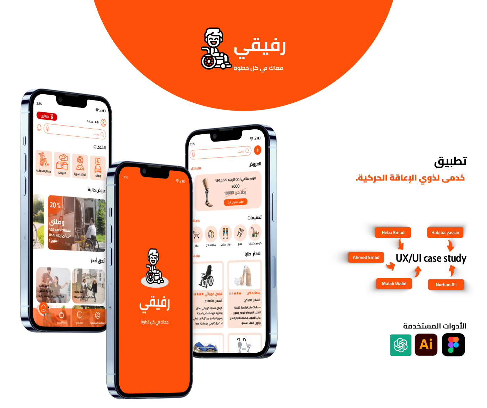

# 🌟 Raffeki UI Design

Welcome to the **Raffeki** design showcase! A modern, responsive interface focused on usability, clean aesthetics, and a seamless user experience.

## 🔗 Live Design Links

### 🎨 Figma

### 🖼️ Behance

---

> ✨ Designed with passion to create intuitive and elegant user experiences.
